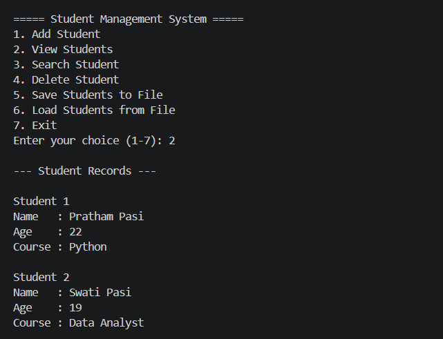
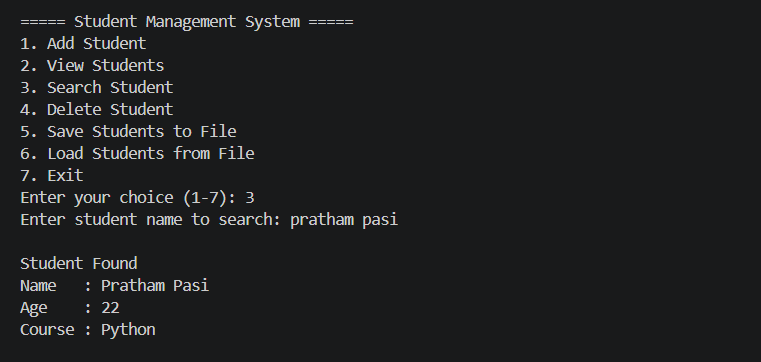
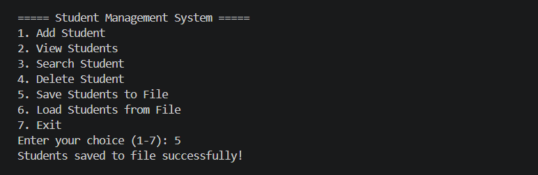

# 🎓 Student Management System


A simple **Command Line Interface (CLI)** application built with **Python** to manage student records.

This project was developed while learning Python fundamentals and demonstrates how core programming concepts come together to build a real-world application.

---

# ✨ Features

* ➕ Add Student
* 📋 View All Students
* 🔍 Search Student
* 🗑 Delete Student
* 💾 Save Student Records to File
* 📂 Load Student Records from File
* ✅ Input Validation
* ⚠ Exception Handling
* 📁 Persistent Storage using Text Files

---

# 🛠 Technologies Used

* Python 3
* Functions
* Lists
* Dictionaries
* Loops
* File Handling
* Exception Handling
* Input Validation

---

# 📂 Project Structure

```text
student-management-system/
│
├── screenshots/
│   ├── demo1-view.png
│   ├── demo2-search.png
│   └── demo3-save.png
│
├── student_management_system.py
├── students.txt
├── README.md
├── LICENSE
└── .gitignore
```

---

# 🚀 Getting Started

## Clone the repository

```bash
git clone https://github.com/pratham133/python-projects.git
```

---

## Navigate to the project folder

```bash
cd python-projects/student-management-system
```

---

## Run the project

```bash
python student_management_system.py
```

---

# 📸 Demo

## 📋 View Students



---

## 🔍 Search Student



---

## 💾 Save Students



---

# 📚 Concepts Practiced

This project helped me practice:

* Variables
* User Input
* Conditional Statements
* Loops
* Functions
* Lists
* Dictionaries
* File Handling
* Exception Handling
* Input Validation
* Modular Programming
* Code Refactoring

---

# 🎯 Future Improvements

* ✏ Update Student Records
* 📊 Sort Students
* 📤 Export Records to CSV
* 🗄 SQLite Database Integration
* 🖥 Graphical User Interface (Tkinter)
* 🔐 Login Authentication

---

# 💡 Lessons Learned

While building this project, I learned:

* How to organize Python programs using functions.
* How to work with lists and dictionaries together.
* How to save and load data using text files.
* How to validate user input and handle exceptions.
* Why clean code and project structure are important.

---

# 👨‍💻 Author

**Pratham Pasi**

Aspiring AI/ML Engineer | Learning Python one project at a time 🚀

GitHub: https://github.com/pratham133

---

⭐ If you found this project helpful, consider giving the repository a star!
